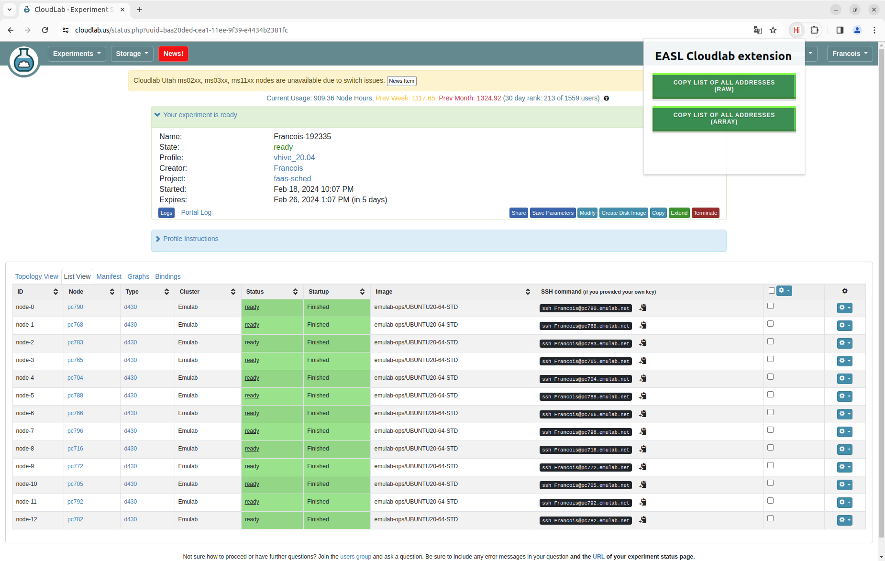

<!-- PROJECT LOGO -->
<br />
<div align="center">
  <a href="https://github.com/othneildrew/Best-README-Template">
    
  </a>

<h1 align="center">Dirigent</h1>

---

[](https://github.com/eth-easl/modyn/actions/workflows/workflow.yaml)
[](https://img.shields.io/github/license/eth-easl/modyn)

  <p align="center">
    A research cluster manager built at ETH Zürich
    <br />
    <a href="https://systems.ethz.ch/"><strong>Systems groups page »</strong></a>
    <br />
  </p>


  <p></p>
</div>


<!-- ABOUT THE PROJECT -->
## About The Project

The cluster manager in question has been developed within the <a href="https://systems.ethz.ch/research/easl.html"> Efficient Architectures and Systems Lab (EASL) </a> at ETH Zürich. It has been designed and fine-tuned specifically to the requirements of Function as a Service (FaaS) paradigms.

Serverless computing optimizes cloud resource use for better performance. Yet, current serverless cluster managers are retrofitted from old systems, not built for serverless tasks. We examine Knative-on-K8s, a modern serverless cluster manager. It causes delays and 65%+ of latency for cold start function calls. These issues arise during high sandbox changes, common in production serverless setups. We identify the problem and suggest new design principles to enhance performance by rethinking cluster manager architecture.

| Feature of K8s-based FaaS system design that contributes to high scheduling latency                               | Insight for Dirigent design                                                                                                    |
|------------------------------------------------------------------------------------------------------------------|--------------------------------------------------------------------------------------------------------------------------------|
| Managing a large volume of state for many, hierarchical abstractions in K8s (e.g., Deployments, ReplicaSets).     | Simple internal cluster management abstractions.                                                                               |
| Persisting and serializing each cluster state update on the critical path of cold function invocations.           | Persistence-free latency-critical operations, relaxing exact cluster state reconstruction as it is abstracted from FaaS users. |
| Microservice-based control plane with RPC communication between components.                                       | Monolithic control plane.                                                                                                      |
| Per-sandbox sidecars on workers for concurrency throttling.                                                       | Monolithic data plane for request throttling.                                                                                  |

Dirigent supports similar features to Knative, making it as a replacement tool for various deployment needs. 

| Feature                                           | Options                                                               |
|---------------------------------------------------|-----------------------------------------------------------------------|
| Load Balancing                                    | Random, Round Robin, Least Proceed, Knative                           |
| Autoscaler                                        | Default Knative Autoscaler, Escargot, Mu Policy                       |
| Placement Policy                                  | Random, Round Robin, K8s Placement                                    |
| Runtimes                                          | Containerd, Firecracker, Dandelion (in progress)                      |
| Request / Component level fault tolerance  | Asynchronous requests, High Availability Mode through Leader Election |

## Software implementation

See the `README.md` to get started with the code. 

The folder structure is as follows:

* `clients` corresponds to clients that can be used for local testing (see start section)
* `cmd` is the list of programs you can start
* `configs` configuration files

* `internal/control_plane` corresponds to the source code of the master node
* `internal/data_plane` corresponds to the source code of the data plane
* `internal/woker_node` corresponds to the source code of the worker node
* `pkg` are shared packages that are used inside of internal to perform multiple actions
* `proto` represents the proto handlers
* `scripts` are a list of scripts you can use to start and run experiments on Dirigent
* `workload` container images

##  Local development

### Getting the code

You can download a copy of all the files in this repository by cloning the
[git](https://github.com/eth-easl/cluster_manager) repository:
```bash
git clone https://github.com/eth-easl/cluster_manager
```

### Dependencies - Installation


Install HAProxy

```bash
sudo apt update && sudo apt install -y haproxy
sudo cp configs/haproxy.cfg /etc/haproxy/haproxy.cfg

```

### Installation Containerd for local development

Install kubernetes-cni.

```bash
curl -L -o cni-plugins.tgz https://github.com/containernetworking/plugins/releases/download/v0.8.1/cni-plugins-linux-amd64-v0.8.1.tgz
sudo mkdir -p /opt/cni/bin
sudo tar -C /opt/cni/bin -xzf cni-plugins.tgz
```

Custom path installation: 

```bash
INSTALL_PATH='your/path/here'

curl -L -o cni-plugins.tgz https://github.com/containernetworking/plugins/releases/download/v0.8.1/cni-plugins-linux-amd64-v0.8.1.tgz
sudo mkdir -p /opt/cni/bin
sudo tar -C INSTALL_PATH -xzf cni-plugins.tgz
```

### Configure Firecracker for local development

Install Firecracker

```bash
ARCH="$(uname -m)"
release_url="https://github.com/firecracker-microvm/firecracker/releases"
latest=$(basename $(curl -fsSLI -o /dev/null -w  %{url_effective} ${release_url}/latest))
curl -L ${release_url}/download/${latest}/firecracker-${latest}-${ARCH}.tgz \
| tar -xz
sudo mv release-${latest}-$(uname -m) /usr/local/bin/firecracker
sudo mv /usr/local/bin/firecracker/firecracker-${latest}-${ARCH} /usr/local/bin/firecracker/firecracker
sudo sh -c  "echo 'export PATH=\$PATH:/usr/local/bin/firecracker' >> /etc/profile" 
```

Install tun-tap

```bash
git clone https://github.com/awslabs/tc-redirect-tap.git || true
make -C tc-redirect-tap
sudo cp tc-redirect-tap/tc-redirect-tap /opt/cni/bin
```
Install ARP

```bash
sudo apt-get update && sudo apt-get install net-tools
```

Download Kernel

```bash
sudo apt-get update && sudo apt-get install git-lfs
git lfs fetch
git lfs checkout
git lfs pull 
```

Run control plane and data plane processes. Run worker daemon with `sudo` and by hardcoding environmental variable `PATH` to point to the directory where Firecracker is located.

```bash
sudo env 'PATH=\$PATH:/usr/local/bin/firecracker' /usr/local/go/bin/go run cmd/worker_node/main.go 
```

### Clone the code

Firstly, you need to install the control plane and Redis on one machine, data plane on another machine and workers on several other machines. You can simply call the script `remote_install.sh` with the addresses of the machines:

```bash
./remote_install.sh machine1 machine2 ...
```

If your local username differs from your remote username on these machines, you also need to include your remote username in the address:

```bash
./remote_install.sh username@machine1 username@machine2 ...
```

### Fire invocation

Before firing an invocation, two parameters from the sysctl configuration need to be set to a specific state. This enables readiness probes and reach the sandbox from the other nodes.

```bash
# For local readiness probes
sudo sysctl -w net.ipv4.conf.all.route_localnet=1
# For reachability of sandboxes from other cluster nodes
sudo sysctl -w net.ipv4.ip_forward=1
```

Starting the master node, data plane and worker nodes is easy
```bash
# Shell 1
sudo go run cmd/master_node/main.go 
# Shell 2
go run cmd/data_plane/main.go 
# Shell 3
sudo go run cmd/worker_node/main.go
```
Finally, the a request can be sent with this command
```bash
cd clients/sync; go run main.go
```
#### Start the async dataplane


```bash
# Shell 1
sudo go run cmd/master_node/main.go 
# Shell 2
go run cmd/data_plane/main.go --config cmd/data_plane/config_async.yaml
# Shell 3
sudo go run cmd/worker_node/main.go
```

#### Start with persistence layer

```bash
# Shell 2
go run cmd/data_plane/main.go --config cmd/data_plane/config_async.yaml
```

and the command to fire the request

```bash
cd clients/async;go run main.go
```

### Invitro

For more advanced use, please use Invitro.

> https://github.com/vhive-serverless/invitro

### If the network breaks 

Sometimes network might break. This is due to some invalid configuration of iptables. Executing this commands solves the issue.

```bash
sudo iptables -t nat -F
```

##  Cloudlab development

### Setup the cluster

1) Clone the repo locally
2) Clone cloudlab extension

```bash
git clone https://github.com/eth-easl/cloudlab_extension
```

3) Load it on google chrome

> https://developer.chrome.com/docs/extensions/get-started/tutorial/hello-world#load-unpacked
 
4) Start experiment and go to list view




5) Use the extension to modify the files ```common.sh``` and ```string.py```
6) You can use ./remote_install $(python3 string.py) and it will install everything out of the box.

### Start the cluster

There are two possibles scripts for that. In the first you see the logs. The second doesn't show the logs in real time but is one command instead of 4.

With logs:

```bash
# Shell 1
./start_control_plane
# Shell 2
./start_data_plane
# Shell 3
./restart_worker_containerd
```

Without logs:

``` bash
./remote_start_cluster list_of_remote_nodes
```

### Run experiment

This commands allows to run a pre default azure trace which will best automatically installed when using remote_install.

```bash
# Azure trace experiment
./azure.sh trace_size

# RPS experiment
./rps_containerd.sh
```

## For developpers

### Generate proto files

First you have to install the protobuf compiler

```bash
make install_golang_proto_compiler
```

Then you can compile the proto types using the following command

```bash
make proto
```

### Generate mock tests

First you have to install the mockgen library

```bash
make install_mockgen
```

Then you can create the files with the following command

```bash
make generate_mock_files
```

### Docker registry

If you are experimenting with enough images for Docker Hub to start ratelimiting you, you might want to set up a Docker registry on one of your cluster's nodes. The script `deploy_registry.sh` does that: its first argument is the node which you want to set up the registry on, and the other arguments are other nodes in your cluster:

```bash
./deploy_registry.sh username@registrynode username@node1 username@node2 ...
```

### Sized images

For image pulling related experiments, it might be useful to create images which are of a specified size when compressed, and push them to a registry. Given that you already published a base function image to a registry, you can create identical copies of that function image but with different sizes and republish them using the `create_image.sh` script:

```bash
./create_image.sh registry.address/base_image:tag registry.address/new_image image_size
```

For example, to create a 50MiB image based on Dirigent's empty function and push it back on Docker Hub, you can use:

```bash
./create_image.sh docker.io/cvetkovic/dirigent_empty_function:latest docker.io/username/empty-50 50
```

If you've already set up a Docker registry as explained previously, you can use the `populate_registry.sh` script in a similar manner to populate the registry with various images of various sizes based on the same image. If you want to create 5 images of 50MiB, and 3 images of 100MiB, all based on the empty function, you can use:

```bash
./populate_registry username@registrynode docker.io/cvetkovic/dirigent_empty_function:latest empty 5 50 3 100
```

If you just want to generate images of a specific size without any specific content, you can use `scratch` for the base image.

### Run the tests

```bash
sudo go test -v ./...
```

## Contact

- Lazar Cvetković - lazar.cvetkovic@inf.ethz.ch
- François Costa - fcosta@ethz.ch

## Citation 

```
@misc{cvetković2024dirigent,
      title={Dirigent: Lightweight Serverless Orchestration}, 
      author={Lazar Cvetković and François Costa and Mihajlo Djokic and Michal Friedman and Ana Klimovic},
      year={2024},
      eprint={2404.16393},
      archivePrefix={arXiv},
      primaryClass={cs.DC}
}
```
