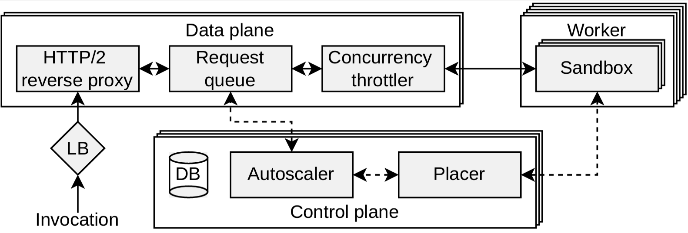

<!-- PROJECT LOGO -->
<br />
<div align="center">
  <a href="https://github.com/othneildrew/Best-README-Template">
    
  </a>

  <h1 align="center">Dirigent</h1>
  <p align="center">
    A serverless cluster manager built by 
    <a href="https://systems.ethz.ch/"><strong>Systems Groups</strong></a> 
    at <a href="https://ethz.ch/"><strong>ETH Zürich</strong></a>
  </p>

[](https://github.com/eth-easl/modyn/actions/workflows/workflow.yaml)
[](https://img.shields.io/github/license/eth-easl/dirigent)

---
  <p>Dirigent is a lightweight cluster manager for FaaS that aims to solve performance issues of existing FaaS platforms. It is a clean-slate system architecture for FaaS orchestration based on three key principles. First, Dirigent optimizes internal cluster manager abstractions to simplify state management. Second, it eliminates persistent state updates on the critical path of function invocations, leveraging the fact that FaaS abstracts sandboxes from users to relax exact state reconstruction guarantees. Finally, Dirigent runs monolithic control and data planes to minimize internal communication overheads and maximize throughput. The architecture of Dirigent is shown on the picture below. Our performance study reveals that compared to current state-of-the-art platforms Dirigent reduces 99th percentile per-function scheduling latency for a production workload by 2.79x compared to AWS Lambda and can spin up 2500 sandboxes per second at low latency, which is 1250x more than with Knative.
  </p>
  
</div>

<div align="center">

### Built With


</div>

## Software implementation

See the `README.md` to get started with the code. 

The folder structure is as follow:

* `api` - proto files for Dirigent components
* `artifact_evaluation` - instructions and material for SOSP'24 artifact evaluation  
* `cmd` - Dirigent components main methods
* `configs` - configuration files for external dependencies
* `internal/master_node` - control plane source code
* `internal/data_plane` - data plane source code
* `internal/worker_node` - worker node source code
* `pkg` - common packages of Dirigent components
* `scripts` - auxiliary scripts
* `workload` - workload we used for evaluation

## Getting the code

You can download a copy of all the files in this repository by cloning the
[git](https://github.com/eth-easl/dirigent) repository:
```bash
    git clone https://github.com/eth-easl/dirigent
```

## Dependencies - Installation

To run the cluster manager locally the following setting must be enabled:
```bash
sudo sysctl -w net.ipv4.conf.all.route_localnet=1
```

Install HAProxy

```bash
sudo apt update && sudo apt install -y haproxy
sudo cp configs/haproxy.cfg /etc/haproxy/haproxy.cfg
```

kubernetes-cni must be installed


```bash
curl -L -o cni-plugins.tgz https://github.com/containernetworking/plugins/releases/download/v0.8.1/cni-plugins-linux-amd64-v0.8.1.tgz
sudo mkdir -p /opt/cni/bin
sudo tar -C /opt/cni/bin -xzf cni-plugins.tgz
```

If you want to install it on a custom path

```bash
INSTALL_PATH='your/path/here'

curl -L -o cni-plugins.tgz https://github.com/containernetworking/plugins/releases/download/v0.8.1/cni-plugins-linux-amd64-v0.8.1.tgz
sudo mkdir -p /opt/cni/bin
sudo tar -C INSTALL_PATH -xzf cni-plugins.tgz
```

## Start Dirigent on a cluster

Prepare a Cloudlab cluster of at least 5 nodes. We tested our setup on xl170 and d430 nodes. Clone the repository locally, configure `scripts/setup.cfg` and run the following script to deploy the cluster. The load generator will be deployed on node0, control plane with Redis on node1, data plane on node2, and the rest of the nodes will be used as worker nodes.

```bash
./scripts/remote_install.sh user@node0 user@node1 user@node2 user@node ...
```

After this setup, you run the following scripts to (re)start the cluster.

```bash
./scripts/remote_start_cluster.sh user@node0 user@node1 user@node2 user@node ...
```

We recommend using [Invitro Load Generator](https://github.com/vhive-serverless/invitro) on rps_mode branch for running experiments with Dirigent cluster manager. The load generator will be automatically cloned on node0 after running `scripts/remote_install.sh`.

## Start Dirigent locally

Start a Redis DB instance

```bash
sudo docker-compose up
```

Start the master node

```bash
cd cmd/master_node; sudo /usr/local/go/bin/go run main.go --config cmd/config.yaml
```

Start the data plane

```bash
cd cmd/data_plane; go run main.go --config cmd/config.yaml
```

Start the worker node

```bash
cd cmd/worker_node; sudo /usr/local/go/bin/go run main.go --config cmd/config.yaml
```

#### Potential problems

In case you get a timeout, try to run the following command and then repeat the experiment.

```bash
# For local readiness probes
sudo sysctl -w net.ipv4.conf.all.route_localnet=1
# For reachability of sandboxes from other cluster nodes
sudo sysctl -w net.ipv4.ip_forward=1
```

## Configure Firecracker for local development

- Install Firecracker
```bash
ARCH="$(uname -m)"
release_url="https://github.com/firecracker-microvm/firecracker/releases"
latest=$(basename $(curl -fsSLI -o /dev/null -w  %{url_effective} ${release_url}/latest))
curl -L ${release_url}/download/${latest}/firecracker-${latest}-${ARCH}.tgz \
| tar -xz
sudo mv release-${latest}-$(uname -m) /usr/local/bin/firecracker
sudo mv /usr/local/bin/firecracker/firecracker-${latest}-${ARCH} /usr/local/bin/firecracker/firecracker
sudo sh -c  "echo 'export PATH=\$PATH:/usr/local/bin/firecracker' >> /etc/profile" 
```
- Install tun-tap
```bash
git clone https://github.com/awslabs/tc-redirect-tap.git || true
make -C tc-redirect-tap
sudo cp tc-redirect-tap/tc-redirect-tap /opt/cni/bin
```
- Install ARP
```bash
sudo apt-get update && sudo apt-get install net-tools
```
- Download Kernel
```bash
sudo apt-get update && sudo apt-get install git-lfs
git lfs fetch
git lfs checkout
git lfs pull 
```
- Run control plane and data plane processes. Run worker daemon with `sudo` and with hardcoded environmental variable `PATH` to point to the directory where Firecracker is located.
```bash
sudo env 'PATH=\$PATH:/usr/local/bin/firecracker' /usr/local/go/bin/go run cmd/worker_node/main.go 
```

#### If the network breaks locally

```bash
sudo iptables -t nat -F
```

## License

Distributed under the MIT License. See `LICENSE` for more information.

## Contact

Lazar Cvetković - lazar.cvetkovic@inf.ethz.ch

François Costa - fcosta@ethz.ch

Ana Klimovic - aklimovic@ethz.ch

## For developers

### Generate proto files

First you have to install the protobuf compiler

```bash
make install_golang_proto_compiler
```

Then you can compile the proto types using the following command

```bash
make proto
```

### Generate mock tests

First you have to install the mockgen library

```bash
make install_mockgen
```

Then you can create the files with the following command

```bash
make generate_mock_files
```

### Run the tests

```bash
sudo go test -v ./...
```

### Linter

```bash
golangci-lint run --fix
```

or with verbose

``` bash
golangci-lint run -v --timeout 5m0s
```

## Citation 

```
@inproceedings{10.1145/3694715.3695966,
author = {Cvetkovi\'{c}, Lazar and Costa, Fran\c{c}ois and Djokic, Mihajlo and Friedman, Michal and Klimovic, Ana},
title = {Dirigent: Lightweight Serverless Orchestration},
year = {2024},
isbn = {9798400712517},
publisher = {Association for Computing Machinery},
address = {New York, NY, USA},
url = {https://doi.org/10.1145/3694715.3695966},
doi = {10.1145/3694715.3695966},
booktitle = {Proceedings of the ACM SIGOPS 30th Symposium on Operating Systems Principles},
pages = {369–384},
numpages = {16},
location = {Austin, TX, USA},
series = {SOSP '24}
}
```
